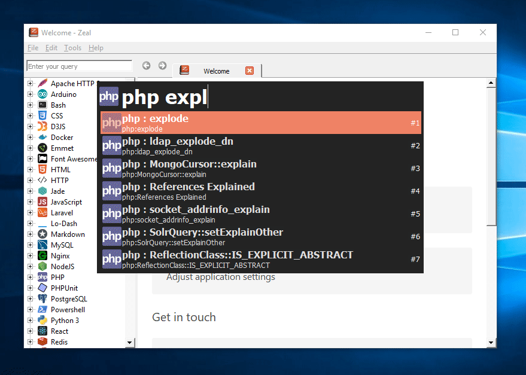
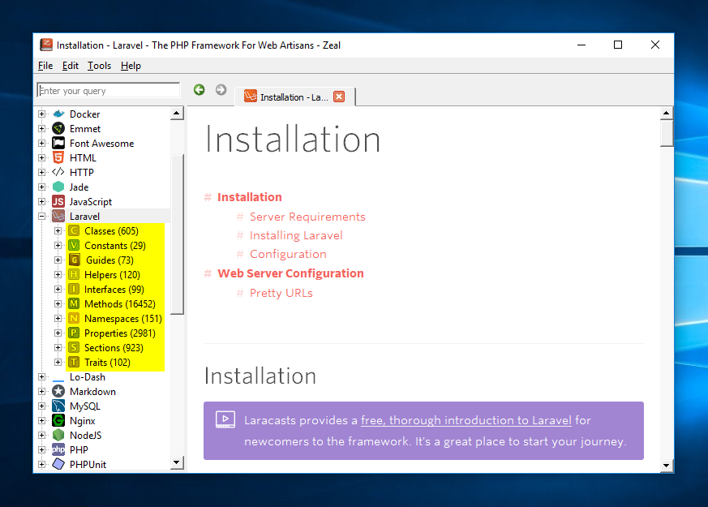
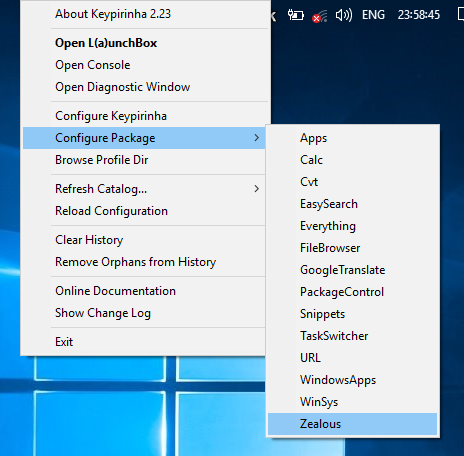
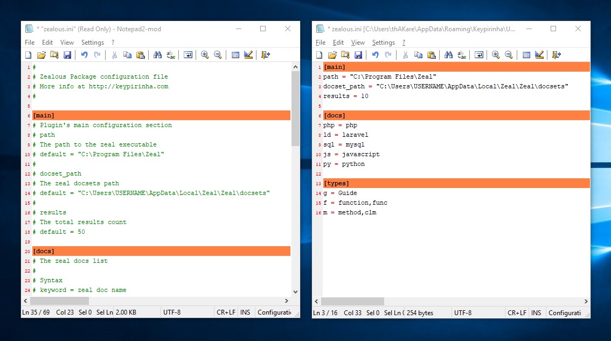
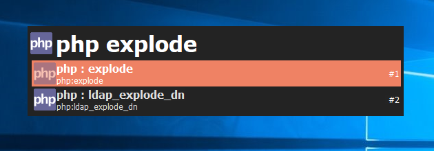

# Keypirinha Plugin: Zealous

This is Zealous, a plugin for the
[Keypirinha](http://keypirinha.com) launcher.

This plugin is developed to facilitate the offline documentation search using the awesome Zeal app.

|  |
| :-: |
| *Zealous demo* |


## Background

[Zeal](https://zealdocs.org) is one of the best offline documentation search tool available today. Its docsets are made available by [Dash](https://kapeli.com).

|  |
| :-: |
| *Zeal App for Windows* |

It provides the ability to install docsets for almost all of the mainstream languages, tools, toolsets and everything that can have its own docset. It can filter the results as per the result type (highlighted above 👆).

## Install

There are two ways to install:

1. Using **[PackageControl](https://github.com/ueffel/Keypirinha-PackageControl)**:

    - Invoke Keypirinha and type `install package`.
    - Click enter.
    - Now search for package `Keypirinha-Zealous`.
    - Again press enter.

2. Manual:

    Download the latest plugin file from [here](https://github.com/bantya/Keypirinha-Zealous/releases/latest).

    Once the `Zealous.keypirinha-package` file is downloaded, move it to the `InstalledPackage` folder located at:

    - `Keypirinha\portable\Profile\InstalledPackages` in **Portable mode**
    - **Or** `%APPDATA%\Keypirinha\InstalledPackages` in **Installed mode** (the
    final path would look like
    `C:\Users\%USERNAME%\AppData\Roaming\Keypirinha\InstalledPackages`)

**NOTE:** You may have to manually restart Keypirinha to see the package activated.


## Configuration

1. Open the Zealous config file.

    |  |
    | :-: |
    | *Zealous configuration menu* |

2. The **main** section is necessary if you installed the Zeal to non-default location. You will have to provide the **Zeal install path** and **the docsets path** in this case.

    The **result** is the count of how many entries to be fetched from the Zeal docsets. **Default: 50**

3. Add the entries to the **docs** section.

- The syntax for the **docs** entry should be:

    ```
    [Docset mnemonic] = [The zeal docset search phrase]

    e.g.

    php = php
    ld = laravel
    js = javascript
    sql = mysql
    py = python
    ```
    
    ℹ *The zeal docset search phrase i.e. zeal doc identifier can be discoverd as explained [here](https://github.com/bantya/Keypirinha-Zealous/issues/1#issuecomment-565587630).*

4. Add the entries to the **types** section.

    Which can be seen as highlighted part in Zeal App image above 👆.

- The syntax for the **types** entry should be:

    ```
    [Type mnemonic] = [The zeal docset types]

    e.g.

    g = Guide
    h = Helper
    sec = Section
    key = Keyword
    ```

    ℹ *The docset types can be found [here](https://kapeli.com/docsets#supportedentrytypes).*

- There are some quirks. Some dataset entrytype (as Zeal calls it) are not as exact as the specified in [here](https://kapeli.com/docsets#supportedentrytypes).

    Especially, **php** along with some other docsets, does not follow the rule. So to make it play even with such docsets, we have to add the supported non-exact result types also.

    ```
    e.g.

    f = Function,func
    m = Method,clm
    c = Class,cl
    p = Property,instp
    t = Type,tdef
    mc = Macro,macro
    ```

- All the fields in the above syntax are REQUIRED.

|  |
| :-: |
| *Zealous configuration files* |

## Usage

Invoke Keypirinha and put the terms as follows.

- The syntax for the usage should be:

    ```
    [Docset mnemonic] [Result type]? [Search term]

    e.g.

    php explode  -> searches 'explode' in PHP docset
    ld g auth  -> searches 'auth' of 'Guide' type in Laravel docset
    js key ...obj  -> searches '...obj' of 'Keyword' type in Javascipt docset
    ```

|  |
| :-: |
| *Zealous simple usage.* |

- Though the usage of [Result type] is optional, using it filters the results only to that type.

|  |
| :-: |
| *Zealous advanced usage with type provided.* |


## Change Log

### v1.0.2

- Corrected package-name typo.

### v1.0.1

- Added PackageControl section in README.
- Updated config file.

### v1.0.0

- Bumped version to v1.0.0
- Full working release.
- Added advanced searching ability.
- Updated the README.

### v0.0.2 (Unreleased)

- Added docset db search.
- Added simple searching.

### v0.0.1 (Unreleased)

- First working draft


## License

This package is distributed under the terms of the **MIT license**.


## Credits

_Do some work and add your name here!_


## Contribute

This is how to contribute:
1. Check for open issues or open a fresh issue to start a discussion around a
   feature idea or a bug.
2. Fork this repository on GitHub to start making your changes to the **dev**
   branch.
3. Send a pull request.
4. Add yourself to the *Contributors* section below (or create it if needed)!

## And what?

Thanks to all.
